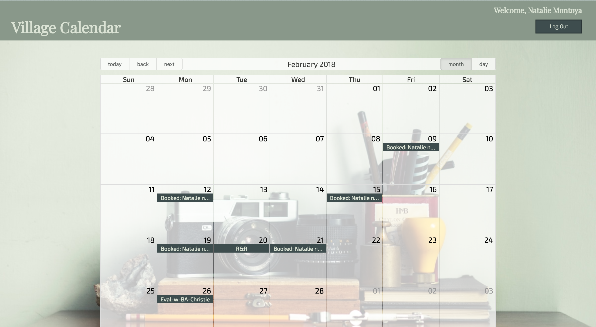

Welcome to Village Calendar!

Village Calendar App is a calendar organization app that uses the Google Calendar API . A user logs in and is authenticated with their google login. The user can create a new calendar and give friends access to that calendar. A user can also load existing calendars. Events can be added, edited, or deleted from the calendar. 

To get started:
  - clone repository
  - [npm install](#npm-install)
  - [npm start](#npm-start)
  - Open [http://localhost:3000](http://localhost:3000) to view it in the browser.

To run tests:
  - [npm test](#npm-test)
  

